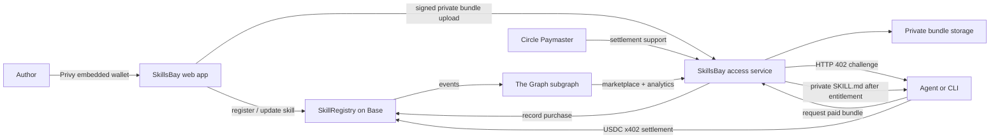
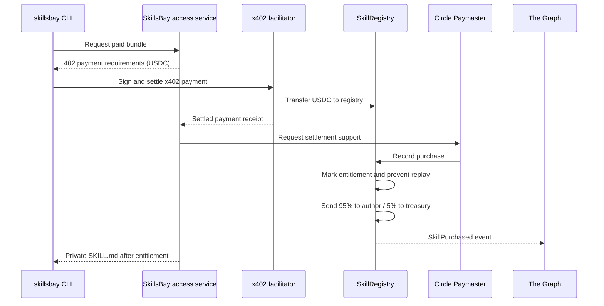
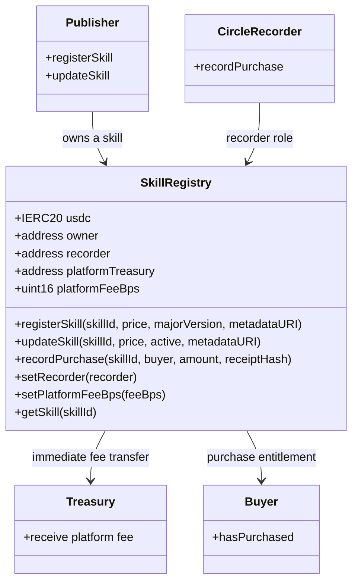
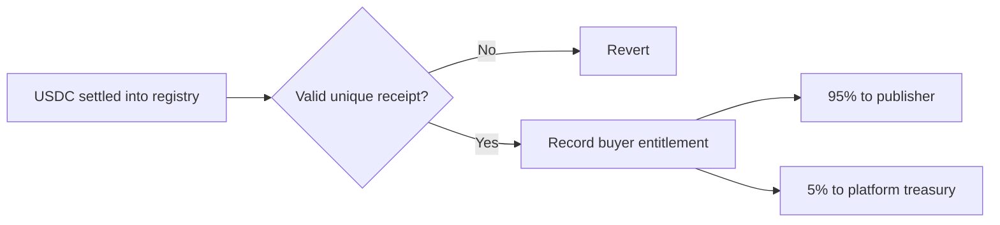
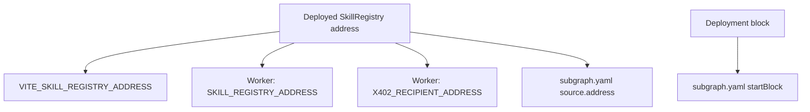

# SkillsBay

SkillsBay is a Web3-native package manager and marketplace for paid AI-agent skills. Publishers list private `SKILL.md` bundles, agents pay once in USDC through x402, and the CLI installs the purchased skill into `.agents/skills` or `.claude/skills`.

SkillsBay uses the following partner services:

- **Base** provides skill registration, purchase receipts, and immediate royalty settlement.
- **The Graph** indexes skills, purchases, author earnings, and installation analytics.
- **Privy** gives authors passwordless onboarding and embedded-wallet publishing.
- **x402** gives agents a standard HTTP 402 payment flow.
- **Circle Paymaster** supports reliable USDC-denominated settlement operations.

## System architecture



## Purchase lifecycle



## Repository structure

```text
.
├── src/                         # Vite + React marketplace and author dashboard
│   ├── components/               # Atomic UI components and shadcn primitives
│   ├── pages/                    # Marketplace, skill, publish, and dashboard routes
│   └── lib/                      # Browser API and chain helpers
├── worker/                       # Access API and x402 entitlement gate
│   ├── index.ts                  # API routes and settlement orchestration
│   └── storage.ts                # Private bundle storage
├── db/migrations/                # Application data schema migrations
├── packages/
│   ├── cli/                      # `npx skillsbay add <namespace>/<skill>`
│   ├── contracts/                # Foundry project for SkillRegistry
│   │   ├── src/                  # Solidity source and mocks
│   │   ├── script/               # Guarded Sepolia and mainnet deployment scripts
│   │   └── test/                 # Foundry tests
│   ├── shared/                   # Shared signed authorization formats
│   └── subgraph/                 # The Graph manifest, schema, mappings, and ABI
└── .storybook/                   # Storybook configuration for the UI system
```

## Configuration map

All local configuration templates live at the workspace root. Each file belongs to one runtime, which keeps public browser values, Worker secrets, and deployment credentials separate.

| File | Used by | Contains |
| --- | --- | --- |
| `.env` | Vite | Browser-safe `VITE_*` values only. |
| `.dev.vars` | Wrangler local development | Worker secrets and local bindings. |
| `.env.sepolia` | Contract deploy command | Base Sepolia deployment inputs. |
| `.env.mainnet` | Contract deploy command | Base mainnet deployment inputs. |

Copy from the matching `.example` file. None of the real environment files should be committed.

## Smart-contract design

`SkillRegistry` is intentionally small. It does not custody publisher earnings or require a withdrawal flow. Purchase settlement distributes USDC in the same transaction that records the buyer’s entitlement.



### Roles and permissions

| Role | What it can do |
| --- | --- |
| Registry owner | Rotate the recorder and adjust the platform fee within the contract cap. |
| Publisher | Register a new skill and update only their own skill’s price, active state, and metadata URI. |
| Recorder smart account | Record a settled x402 receipt exactly once. It cannot edit skills or change protocol settings. |
| Buyer | Pays for a skill and receives a permanent on-chain purchase entitlement. |

### Settlement rules



The contract validates that the skill exists and is active, the amount equals its listed price, the buyer has not already purchased it, and the payment receipt has not already been processed.

## Deployment modes

| Command | Network | Initial owner and treasury |
| --- | --- | --- |
| `pnpm deploy:registry` | Base Sepolia | The deployment account |
| `pnpm deploy:registry -- --mainnet` | Base mainnet | The project Safe |

The mainnet script is chain-guarded and refuses to execute anywhere except Base mainnet. The guarded deploy command also checks `SKILL_REGISTRY_ADDRESS` and Foundry broadcast output before submitting a new deployment.

### Contract deployment

```bash
# Base Sepolia
cp .env.sepolia.example .env.sepolia
# Fill the placeholder values, then:
pnpm deploy:registry

# Base mainnet
cp .env.mainnet.example .env.mainnet
# Fill the placeholder values, then:
pnpm deploy:registry -- --mainnet
```

The recorder address configured at deployment must be the public address derived from the same secret configured in the Worker as `RECORDER_PRIVATE_KEY`.

## Circle Paymaster

Circle Paymaster supports reliable USDC-denominated gas for settlement operations. Its implementation credentials and operational configuration remain private to the deployment environment.

## Post-deployment configuration

After a successful contract deployment, configure the emitted registry address in all consumers:



Then deploy the subgraph and set `GRAPH_API_URL` in the Worker. The Worker uses the indexed data for marketplace rankings and author analytics.

```bash
pnpm --filter @skillsbay/subgraph run deploy
```

### Application deployment

Deploy the marketplace UI and access service with the deployment script:

```bash
pnpm run deploy:worker
```

### Continuous deployment

Merges to `main` run [`.github/workflows/deploy.yml`](.github/workflows/deploy.yml): it builds the marketplace, applies pending remote D1 migrations, then deploys the Worker. Configure the `production` GitHub environment with `CLOUDFLARE_API_TOKEN` and `CLOUDFLARE_ACCOUNT_ID`.

The Worker is bound to `skillsbay.dev` as a Wrangler custom domain. Before the first production deployment, add and activate the `skillsbay.dev` zone in that same Cloudflare account.

The Worker derives canonical and social URLs from the request origin, keeping the marketplace UI and API on the same deployment origin.

When a merge changes `packages/cli`, the same workflow builds and publishes the `skillsbay` npm package with npm trusted publishing (GitHub OIDC). Bump `packages/cli/package.json` first; npm versions are immutable. The `npm` GitHub environment needs no npm token, but must be configured as the package's trusted publisher.

Keep deployment credentials and service secrets out of source control. Public application settings should be limited to values that are safe to expose in the browser or client configuration.

## Local development

```bash
pnpm install
cp .dev.vars.example .dev.vars
pnpm db:migrate:local
pnpm dev
```

Run Storybook for the shadcn-based UI system:

```bash
pnpm storybook
```

## Verification

```bash
pnpm build
pnpm --filter skillsbay build
(cd packages/contracts && forge test)
pnpm --filter @skillsbay/subgraph codegen
pnpm --filter @skillsbay/subgraph build
```

## Security notes

- Never commit private keys, RPC credentials, deployment outputs containing sensitive data, or service secrets.
- Keep payment-operation credentials in the deployment secret store and limit their on-chain authority to purchase recording.
- Keep the registry owner in a multisig Safe for production deployments.
- Keep bundles in private storage and rotate service credentials if compromise is suspected.
- Verify the deployed registry owner, recorder, treasury, USDC token, and fee before enabling payments.

## Hackathon tracks

The sponsor implementation details and demo evidence map are documented in [HACKATHON.md](./HACKATHON.md).
