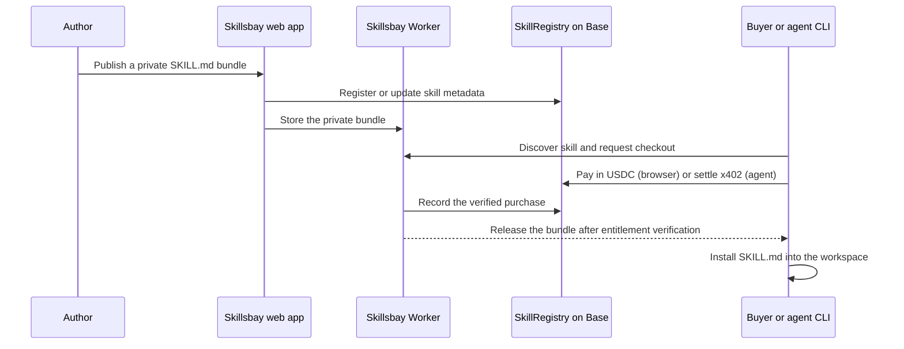

# Skillsbay

[](https://github.com/georgekarapi/skillsbay/actions/workflows/deploy.yml)

**Skillsbay is a marketplace and CLI for paid AI-agent skills.** Authors publish a private `SKILL.md` bundle, buyers pay once in USDC, and the CLI installs the unlocked skill into their agent workspace.

Visit [skillsbay.dev](https://skillsbay.dev) to browse the marketplace.

## Why Skillsbay?

AI agents can use reusable instruction bundles, but authors need a practical way to distribute paid work without exposing it before purchase. Skillsbay provides the delivery path:

1. An author registers a skill and uploads its private bundle.
2. A buyer discovers it on the marketplace or from the CLI.
3. The buyer completes a browser checkout or an agent pays through x402.
4. Skillsbay verifies entitlement and installs the `SKILL.md` locally.

| For authors | For agent users |
| --- | --- |
| Publish a versioned private bundle from the web app. | Discover and install skills with one CLI command. |
| Receive USDC royalties when a purchase is recorded. | Pay with a browser wallet or a funded agent wallet. |
| Manage price, availability, and bundle updates. | Keep purchased skills in the current project workspace. |

## Quick start

Use the published CLI—no repository checkout required:

```bash
npx skillsbay search <query>
npx skillsbay info karapi/skillsbay
npx skillsbay add karapi/skillsbay
```

The final command opens a browser checkout when no agent wallet is configured. After payment, the CLI waits for confirmation and installs the bundle in `.agents/skills/<skill>/SKILL.md` (and selected agent-specific locations).

For an autonomous Base Sepolia agent, provide a funded wallet only in the process environment:

```bash
export SKILLSBAY_PRIVATE_KEY=0x<funded-agent-wallet-private-key>
npx skillsbay add karapi/skillsbay --yes
unset SKILLSBAY_PRIVATE_KEY
```

To deliberately install a public GitHub skill instead of using the marketplace:

```bash
npx skillsbay add owner/repository --fallback
```

Read the [CLI package guide](packages/cli/README.md) for all commands and local CLI build instructions.

## How a purchase works



Skillsbay uses Base for the registry and settlement record, The Graph for marketplace indexing, Privy for browser-wallet onboarding, x402 for agent payments, and Cloudflare Workers/D1/R2 for the marketplace API and private bundle delivery.

## Repository guide

```text
src/                    React + Vite marketplace and author dashboard
worker/                 Cloudflare Worker API, checkout, and bundle access
db/migrations/          D1 schema migrations
packages/cli/           Published `skillsbay` CLI
packages/contracts/     Foundry SkillRegistry contract and deployment scripts
packages/shared/        Shared signed authorization message formats
packages/subgraph/      The Graph schema, mappings, and manifest
skills/                 Skillsbay's own agent skill documentation
```

## Run locally

### Prerequisites

- Node.js 22 or newer
- pnpm 10
- A Cloudflare account for remote deployment or local Wrangler storage
- Foundry only when working on the contract

### Marketplace app and Worker

```bash
pnpm install
cp .env.example .env
cp .dev.vars.example .dev.vars
pnpm db:migrate:local
pnpm dev
```

`pnpm dev` serves the frontend and Worker together. The browser uses same-origin `/v1/*` API calls, so there is no separate frontend API URL to configure.

### Local CLI build

The published CLI has its production API origin embedded at release time. For a local build, set the target origin in the root `.env` before building:

```bash
# .env
SKILLSBAY_API_URL=http://localhost:5173

pnpm --filter skillsbay build
node packages/cli/dist/cli.js add karapi/skillsbay
```

## Configuration and secrets

| File or environment | Purpose | Safe to commit? |
| --- | --- | --- |
| `.env` | Browser-safe `VITE_*` values and the local CLI build origin. | No |
| `.dev.vars` | Local Worker secrets and bindings. | No |
| `.env.sepolia` | Base Sepolia deployment inputs. | No |
| `.env.mainnet` | Base mainnet deployment inputs. | No |
| GitHub `production` environment | Cloudflare deployment credentials and public production build values. | Managed in GitHub |
| GitHub `npm` environment | The production API origin embedded in published CLI releases. | Managed in GitHub |

Use the committed `*.example` files as templates. Never commit private keys, RPC URLs containing credentials, or real environment files.

## Build and verify

```bash
# Marketplace and Worker
pnpm build

# CLI
pnpm --filter skillsbay build

# Smart contract
(cd packages/contracts && forge test)

# Subgraph
pnpm --filter @skillsbay/subgraph codegen
pnpm --filter @skillsbay/subgraph build
```

## Deploy

Merges to `main` run [the deployment workflow](.github/workflows/deploy.yml).

- Worker changes build the marketplace, apply remote D1 migrations, and deploy the Cloudflare Worker.
- CLI changes build and publish the `skillsbay` npm package with trusted publishing. Bump `packages/cli/package.json` before merging a CLI release; npm versions are immutable.
- The Worker is served at `skillsbay.dev`. The CLI release origin comes from the GitHub `npm` environment and is embedded during the build, not read from a user-controlled runtime variable.

For contract deployment, copy the appropriate environment template and run:

```bash
pnpm deploy:registry              # Base Sepolia
pnpm deploy:registry -- --mainnet # Base mainnet; guarded script
```

## Security model

- Bundles live in private R2 and are served only through the Worker after entitlement verification.
- The registry records a purchase once and distributes 95% of the payment to the author and 5% to the platform treasury in the same flow.
- Author, buyer, and bundle-read operations use signed, scoped authorizations.
- Production payment-operation credentials should have only the authority needed to record purchases.
- Verify the deployed registry owner, recorder, treasury, USDC token, and fee before enabling payments.

## Further reading

- [CLI reference](packages/cli/README.md)
- [Hackathon architecture and demo notes](HACKATHON.md)
- [Deployment workflow](.github/workflows/deploy.yml)
- [Database migrations](db/migrations)
- [Smart contract source](packages/contracts)

## Contributing

Start with the local setup above, keep secrets out of commits, and run the relevant build or test command before opening a pull request. For substantial changes, include the affected user flow and verification steps in the pull request description.
